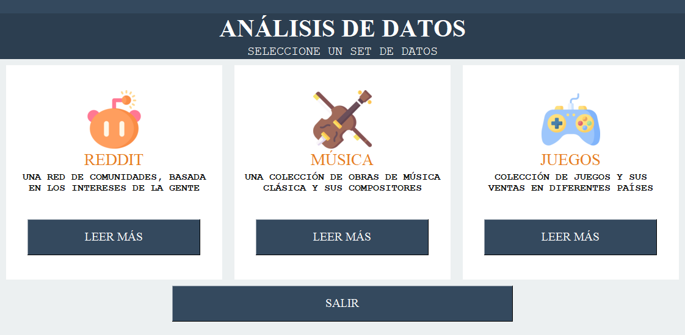
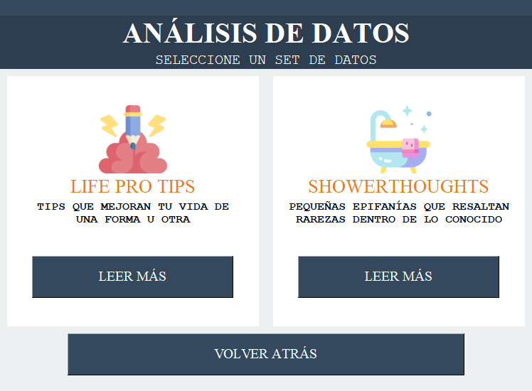

- [Actividad Teórica](#actividad-teórica)
  - [Imágenes](#imágenes)
      - [Pantalla inicial](#pantalla-inicial)
      - [Pantalla reddit](#pantalla-reddit)
  - [Instalación](#instalación)
  - [Explicación](#explicación)
  - [Mi propuesta](#mi-propuesta)
  - [Atribución](#atribución)

# Actividad Teórica
Esta es la resolución a una actividad que nos propusieron en la clase teória de la materia Seminario de Lenguajes.

## Imágenes

#### Pantalla inicial


### Pantalla 'Reddit'


## Instalación
### Instalar los requerimientos

#### Unix/macOS
```
python -m pip install -r requirements.txt
```

#### Windows
```
py -m pip install -r requirements.txt
```
### Ejecutar

#### Unix/maxOS
```
python run.py
```

#### Windows
```
py run.py
```

## Explicación
El trabajo consistía en:
- Crear una GUI que nos permita elegir entre dos datasets para analizar.
- La GUI debía estar hecha en PySimpleGUI
- Guardar el resultado de los análisis en un archivo JSON.
- Debían ser análisis sobre datos que podamos usar en el trabajo final.
- Opcionalmente, podíamos obtener imágenes como parte de los análisis.

## Mi propuesta
Utilizo 4 datasets.

- Los primeros dos, son de Reddit. Fueron obtenidos por mí luego de haber creado un script, también en Python, para recolectar los datos. Son los 1000 top posts de dos subredddits. El análisis obtiene los mejores 10 de cada uno.

Este análisis es medio tonto, pero quería dejarlo porque obtuve los datos yo y porque es mi aplicación y hago lo que quiero.

- El segundo es un dataset sobre composiciones de varios compositores, con algunos datos acerca de cada una. El análisis obtiene las obras de Bach más cortas.

- El tercero es sobre ventas de juegos. El análisis consiste en obtener aquellos que salieron antes del 2000 y los 10 que más ventas tuvieron.

## Atribución
- No encontré información acerca de la licencia y el uso de los datos de Reddit.
- El dataset de ventas de [juegos](https://www.kaggle.com/gregorut/videogamesales) no especifica ninguna licencia.
- El dataset de [música](https://www.kaggle.com/imsparsh/musicnet-dataset?select=musicnet_metadata.csv) tiene licencia: [CC0 1.0 Universal (CC0 1.0)](https://creativecommons.org/publicdomain/zero/1.0/)

Los íconos que utilicé son hechos por [Freepik.](https://www.flaticon.com/authors/freepik)

